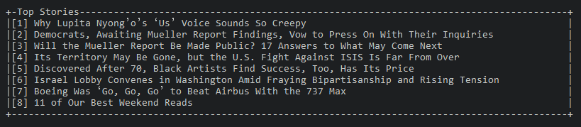

# Headlines

[](https://travis-ci.org/mgmarlow/headlines)
[](https://goreportcard.com/report/github.com/mgmarlow/headlines)

Top news stories straight to the terminal.

> Stories brought to you by [News API](https://newsapi.org/).



## Usage

```
go build
./headlines.exe
```
