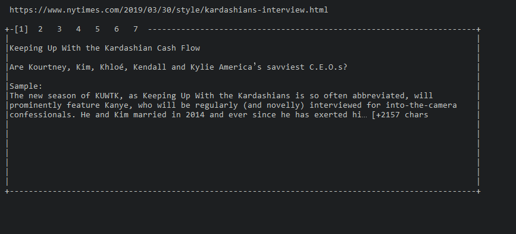

# Headlines

[](https://travis-ci.org/mgmarlow/headlines)
[](https://goreportcard.com/report/github.com/mgmarlow/headlines)

Top news stories straight to the terminal.

> Stories brought to you by [News API](https://newsapi.org/).



## Usage

Grab an API key from the [News API](https://newsapi.org/) and drop it
in a `.env` file at the root of the project.

```
# .env
NEWS_API_KEY=<YOUR KEY HERE>
```

Once that's done, you can successfully build and run the project:

```
go build
./headlines.exe
```

### Controls

Use `<Tab>` to cycle between top stories.
